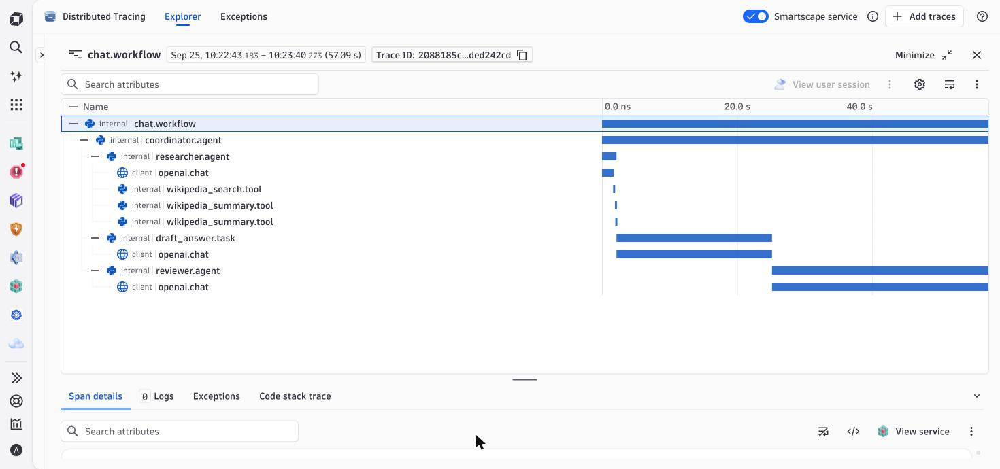
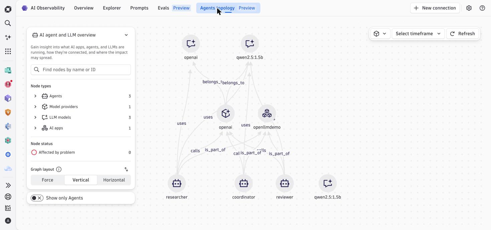
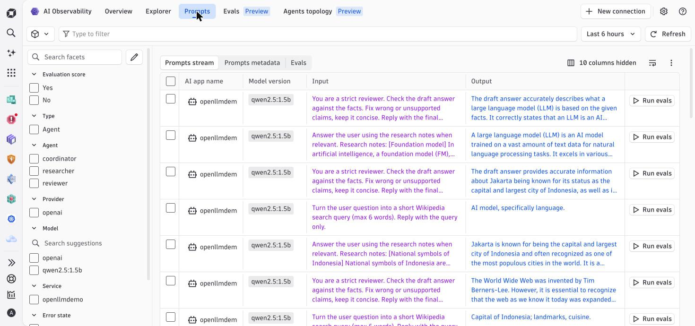
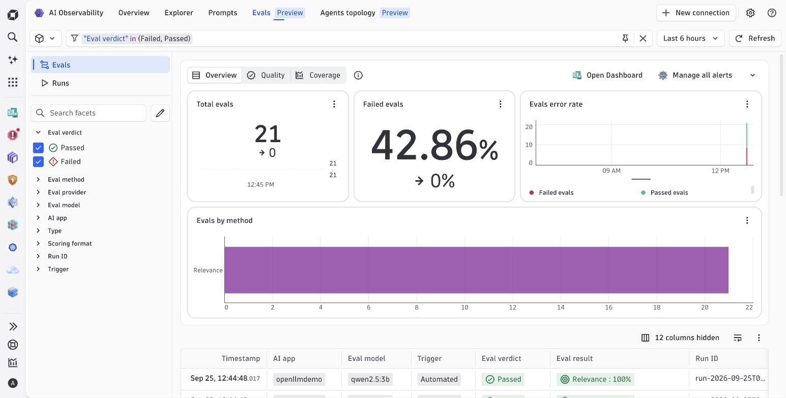

# V4 — Multi-agent app (coordinator → researcher → reviewer)

Same OpenLLMetry instrumentation as v1–v3, but the app is now a small
**multi-agent system** with tool calls — so the trace shows agent hand-offs,
not just one LLM call.

```
POST /chat
  chat.workflow
  └─ coordinator.agent
     ├─ researcher.agent ── openai.chat (make search query)
     │                   ├─ wikipedia_search.tool
     │                   └─ wikipedia_summary.tool ×2
     ├─ draft_answer.task ── openai.chat
     └─ reviewer.agent ───── openai.chat (fact-check the draft)
```

- **LLM:** local [Ollama](https://ollama.com) `qwen2.5:1.5b` (free, CPU-only, no API key).
  Any OpenAI-compatible endpoint works via `LLM_BASE_URL` / `LLM_MODEL` / `LLM_API_KEY`.
- **Tools:** public Wikipedia REST API (no key).
- **Export path:** pick with `TRACE_MODE` — `v1` direct to Dynatrace, `v2` via
  Bindplane collector, `v3` via local OneAgent. Same pipelines as the earlier stages.

What changed vs v1: `@agent`, `@task`, `@tool` decorators from
`traceloop.sdk.decorators` around each step. That's all the extra
instrumentation — Traceloop + Dynatrace do the rest.

## Run

```bash
ollama pull qwen2.5:1.5b          # once
python3 -m venv venv
./venv/bin/pip install -r requirements.txt
cp .env.example .env              # fill in, then:
set -a; . ./.env; set +a
./venv/bin/python app.py
```

Open http://localhost:8080 and ask something, or:

```bash
curl -s localhost:8080/chat -H 'Content-Type: application/json' \
  -d '{"messages":[{"role":"user","content":"What is the capital of Indonesia?"}]}'
```

`"mode": "simple"` in the body skips the agents (single LLM call) — useful to
compare latency and token cost with and without the agent chain.

## What you see in Dynatrace

**Distributed Tracing** — full agent chain in one trace:



**AI Observability → Agents topology** — agents, models and app discovered
from `gen_ai.*` span attributes, no config:



**AI Observability → Prompts** — every prompt/response pair per agent:



> Prompts and responses are captured by default. Set
> `TRACELOOP_TRACE_CONTENT=false` if they may contain sensitive data.

## Evaluate answer quality with dt-evals (LLM-as-a-judge)

Traces tell you *how* the agents ran. [dt-evals](https://github.com/dynatrace-oss/dt-evals)
tells you *how good the answer was*: it pulls the `gen_ai.*` spans back out of
Dynatrace, scores each reviewer answer with an LLM judge, and writes the
scores back as `gen_ai.evaluation.result` business events linked to the
`trace.id` — they show up in **AI Observability → Evals**.

The judge is a local Ollama model (`qwen2.5:3b`, one step up from the app's 1.5B), so it stays free.
[`.dt-eval.yaml`](.dt-eval.yaml) judges the reviewer agent's final answers on
`relevance`, `faithfulness`, `hallucination` and `answer-completeness`.

```bash
# Node.js >= 20
npm install -g @dynatrace-oss/dt-evals

# Platform token with storage:spans:read, storage:bizevents:read,
# storage:events:write — `dt-evals doctor create-token` walks you through it
export DT_ENV_URL=https://<your-tenant>.apps.dynatrace.com
export DT_API_TOKEN=<platform token>
export OPENAI_BASE_URL=http://127.0.0.1:11434/v1
export OPENAI_API_KEY=ollama        # Ollama ignores it, the client needs a value

dt-evals validate
dt-evals run --dry-run              # see which spans would be judged
dt-evals run --store-evaluated-prompt
```

Test run: 21 answers judged on relevance, 57% pass rate, about 20 min on a 2-vCPU VM.



Query the results:

```
fetch bizevents
| filter event.type == "gen_ai.evaluation.result"
| summarize avg_score = avg(gen_ai.evaluation.score.value),
            fails = countIf(gen_ai.evaluation.score.label == "fail"),
            by: {gen_ai.evaluation.name}
```

> A 3B model is a weak judge — fine to show the loop working, not for real
> quality gates. Point `OPENAI_BASE_URL`/`judge.model` at a larger model for that.
